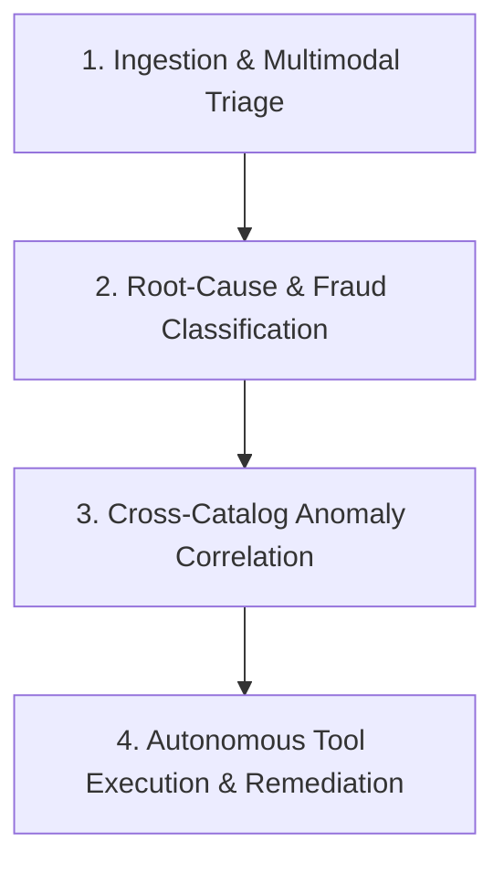

# ReturnOps Agent Engine Skill

## Overview
ReturnOps Agent (ReturnGuard AI) is a multi-step autonomous AI agent built for e-commerce platforms (leveraging QuickXKart's real-world domain context). It replaces manual, reactive customer return processing with proactive, automated root-cause intelligence, fraud detection, vendor anomaly quarantine, and instant customer resolution.

---

## The 4-Step Autonomous Agentic Loop

### 1. Ingestion & Multimodal Triage
- **Inputs**: Return reason, customer free-text complaint, order metadata (SKU, batch ID, vendor ID, price, shipping cost), and uploaded return photo.
- **Multimodal Visual Inspection**: Analyzes product photo to distinguish between:
  - Genuine manufacturing defect (ripped seam, broken zipper, shattered screen)
  - Transit damage (crushed exterior box, intact item)
  - Buyer use / wardrobing fraud (worn clothing, missing tags, altered serials)
  - Perfect condition / buyer remorse.

### 2. Deep Root-Cause & Fraud Classification
- Classifies into canonical taxonomies:
  - `SIZING_MISMATCH` (e.g., shoe runs half size small)
  - `DEFECTIVE_BATCH` (e.g., faulty stitching on Batch #804)
  - `LISTING_MISREPRESENTATION` (e.g., color mismatch with product image)
  - `WARDROBING_FRAUD` / `ABUSIVE_RETURN` (high-velocity returner flag)
  - `BUYER_REMORSE`

### 3. Cross-Catalog Anomaly Correlation
- Analyzes aggregate return velocity across SKUs and vendors:
  - If Return Rate on SKU > 15% OR Defect cluster > 3 reports within 24h $\rightarrow$ Flag **Critical Vendor Anomaly**.
  - Computes economic impact (Gross Merchandise Value lost + Return shipping overhead).

### 4. Autonomous Tool Execution & Remediation
- 📧 **Live Customer Resolution via Resend API**:
  - If return shipping cost > product margin $\rightarrow$ Issue **"Keep It & Get Instant Store Credit"** voucher (saves return logistics cost).
  - If sizing mismatch $\rightarrow$ Dispatch instant 1-click exchange voucher with precise sizing recommendation.
  - If genuine defect $\rightarrow$ Auto-approve instant priority replacement with express dispatch.
- 🛑 **Catalog Self-Healing**: Automatically sets temporary inventory quarantine on defective SKU batches to prevent selling broken stock.
- 📑 **Vendor Penalty & Quality Claim**: Generates structured dispute claims with photo evidence and sends vendor warning.

---

## Technical Stack & API Integration
- **LLM Engine**: Gemini 3.7 Flash with structured JSON schema outputs (`pydantic`).
- **Tool Dispatch**: Resend API for live customer emails, Webhook dispatcher for catalog inventory holds.
- **Observability**: Live thought scratchpad, tool call parameters, execution timestamps, and confidence scores.
